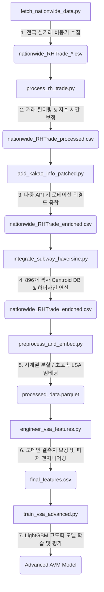
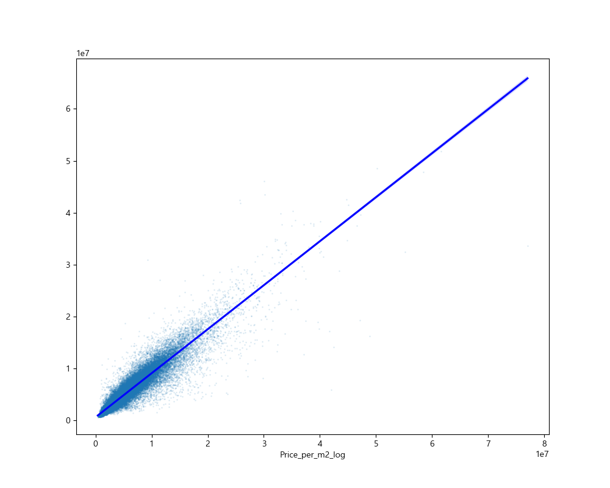
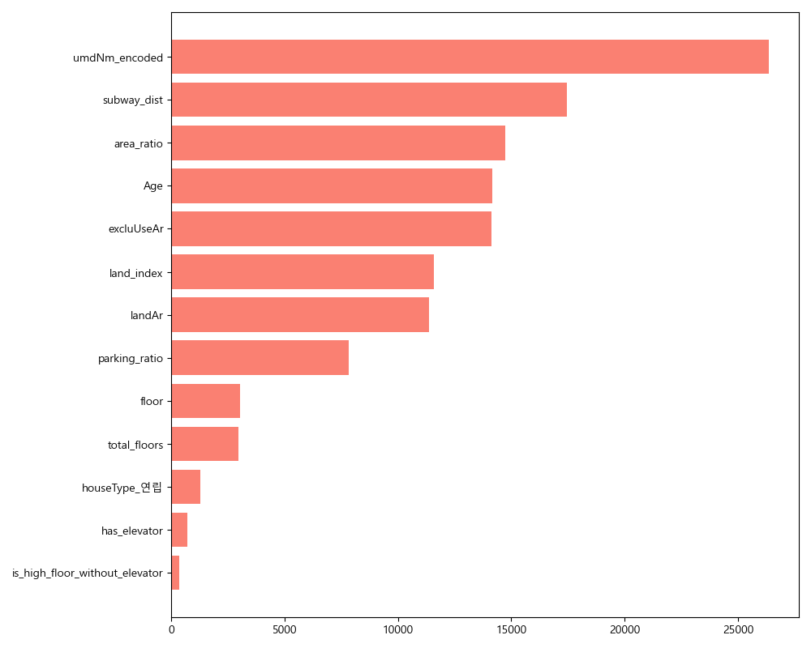

# AppraisalAI Suite: VSA-AVM-Engine

신속하고 정확한 연립-다세대 가치 산정을 위한 전국 단위 데이터 엔지니어링 및 AVM 파이프라인

## 목차
1. [전체 파이프라인 아키텍처](#1-전체-데이터-및-인텔리전스-파이프라인-아키텍처)
2. [핵심 데이터 엔지니어링 기술](#2-핵심-데이터-엔지니어링-기술-스펙)
3. [모델 성능 및 시각화 분석](#3-모델-성능-비교-및-시각화-분석)
4. [모델 사용법 및 필수 요소](#4-모델-사용법-및-필수-요소)
5. [트러블슈팅 및 장애 극복기](#5-트러블슈팅-및-장애-극복기)
6. [GitHub 대용량 파일 복구 가이드](#6-github-대용량-파일-복구-가이드)
7. [향후 계획 (Future Roadmap)](#7-향후-계획-future-roadmap)

---

## 1. 전체 데이터 및 인텔리전스 파이프라인 아키텍처

총 7가지 모듈식 컴포넌트로 구성되어 데이터 수집부터 고도화된 모델 학습까지의 전 과정을 완수합니다.



---

## 2. 핵심 데이터 엔지니어링 기술 스펙

### 1. 카카오 API 다중 키 오타 교정 및 한도 감지 세이프 가드
* **모듈**: `add_kakao_info_patched.py`
* **기술 설명**: 카카오 로컬 API 호출 한도 도달 시 자동으로 다음 키로 회전하는 관리자를 설계했습니다. 또한 윈도우 환경 특유의 소켓 포트 고갈 에러를 해결하고자 커넥션 풀링을 도입했습니다.
* **성과**: 위경도 좌표 결측치를 0.07% 이내로 전면 소거했습니다.

### 2. 전국 896개 역사 Centroid DB 및 하버사인 최단거리 연산
* **모듈**: `integrate_subway_haversine.py`
* **기술 설명**: 카카오 API의 1km 반경 탐색 제한으로 누락된 매물 데이터에 대해, 실거래 데이터들로부터 역사 인접 매물 좌표의 공간적 무게중심(Centroid)을 구해 전국 역사 마스터 DB를 동적으로 재구축했습니다.
* **최적화**: 1억 8천만 번의 하버사인 연산을 NumPy 브로드캐스팅 기법으로 고성능 벡터화하여 단 25초 만에 완수했습니다.

### 3. 데이터 결측치 정밀 정리 및 보강 (Data Imputation)
* **모듈**: `engineer_vsa_features.py`
* **도메인 기반 대체**: 
    * 주차 비율: 법정동별 평균값 또는 기본값(0.5)으로 보정
    * 엘리베이터: 2015년 건축물관리법 강화를 기준으로 건축년도 기반 논리적 대체
    * 총 층수: 매물 층수 정보와의 정합성 검증 및 보완
* **노이즈 정제**: `houseType` 내 '연립다세대' 혼합 텍스트를 '연립'으로 통일하여 데이터 희소성 문제를 해결했습니다.

### 4. 시계열 데이터 누수(Data Leakage) 차단 및 임베딩
* **모듈**: `preprocess_and_embed.py`
* **시계열 분할**: 거래일자 기준 엄격한 오름차순 정렬 후 8:2 분할을 적용하여 미래 정보의 유입을 원천 차단했습니다.
* **LSA 임베딩**: TF-IDF와 TruncatedSVD를 활용하여 128차원의 고밀도 시맨틱 임베딩 행렬을 로컬에서 직접 연산했습니다.

---

## 3. 모델 성능 비교 및 시각화 분석

Baseline 모델에서 출발하여 도메인 지식을 투입한 고도화 모델까지의 성능 개선 및 분석 결과입니다.

### 1. 성능 지표 결과
| 모델 단계 | R2 Score | MAE (원) | MAPE (%) | 특이사항 |
| :--- | :---: | :---: | :---: | :--- |
| **Baseline v1.0** | 0.8650 | 751,910 | 15.81% | 기본 11개 피처 사용 |
| **Advanced v1.2** | **0.8824** | **691,694** | **14.57%** | 도메인 피처 및 Early Stopping 적용 |

### 2. 고도화 모델 분석 시각화
모델의 설명력과 피처 기여도를 시각적으로 분석한 결과입니다.

#### [예측 정확도 분석 (Actual vs Predicted)]
실제 거래가와 모델 예측가의 일치도를 보여줍니다. 대각선에 점들이 밀집될수록 높은 정확도를 의미합니다.


#### [피처 중요도 분석 (Feature Importance)]
부동산 가치 산정에 있어 어떤 변수가 가장 지배적인 영향력을 행사하는지 나타냅니다.


#### [오차 분포 분석 (Error Distribution)]
오차율(MAPE)의 분포를 확인하여 예측의 안정성을 검증합니다.


---

## 4. 모델 사용법 및 필수 요소

학습된 Advanced AVM 모델을 활용하기 위한 필수 데이터 처리 규격입니다.

### 1. 필수 입력 피처 목록
- **건물 특성**: 전용면적(excluUseAr), 대지면적(landAr), 층수(floor), 연식(Age), 총층수(total_floors), 엘리베이터(has_elevator), 주차비율(parking_ratio)
- **입지 지표**: 법정동 인코딩(umdNm_encoded), 지하철 거리(subway_dist), 공시지가 지수(land_index)

### 2. 가공 로직
1.  **입지 캡핑**: `subway_dist`를 최대 1,500m로 제한하여 비역세권 데이터의 편향을 방지합니다.
2.  **거주성 감가**: 4층 이상 건물에 엘리베이터가 없는 경우 감가 피처를 1로 활성화합니다.
3.  **로그 복원**: 모델 예측 결과물에 `np.expm1()`을 적용하여 실제 제곱미터당 금액으로 복원합니다.

---

## 5. 트러블슈팅 및 장애 극복기

1. **카카오 API 키 오타 및 한도 미감지**: 401 및 400 에러 메시지 패턴 분석을 통한 자동 키 스위칭 모듈 개발로 수집 안정성을 확보했습니다.
2. **윈도우 소켓 포트 고갈(WinError 10048)**: 반복적인 HTTP 커넥션 생성을 지양하고 `requests.Session()` 기반 커넥션 풀링을 통해 에러를 차단했습니다.
3. **미계산 지역 지하철 결측**: 1km 외부 지역 매물에 대해 동적 역사 DB와 하버사인 벡터 연산을 적용하여 지하철 결측률을 사실상 소거했습니다.

---

## 6. GitHub 대용량 파일 복구 가이드

GitHub 100MB 제한을 우회하기 위한 데이터 복원 명령어입니다.

```bash
python -c "import zipfile, numpy as np, os; d='data/processed'; zf=zipfile.ZipFile(os.path.join(d, 'nationwide_RHTrade_enriched.zip'), 'r'); zf.extractall(d); p1=np.load(os.path.join(d, 'property_embeddings_part1.npz'))['embeddings']; p2=np.load(os.path.join(d, 'property_embeddings_part2.npz'))['embeddings']; np.save(os.path.join(d, 'property_embeddings.npy'), np.vstack([p1, p2])); print('Original Data Reconstituted Successfully')"
```

---

## 7. 향후 계획 (Future Roadmap)

본 프로젝트는 단순 가치 산정을 넘어 데이터 기반의 종합 프롭테크 엔진으로 진화하기 위해 다음과 같은 고도화 계획을 가지고 있습니다.

1. **실시간 유사 사례 검색 엔진 고도화 (`build_similarity_index.py`)**
   - 현재 구축된 128차원 시맨틱 임베딩 인덱스를 기반으로, 사용자가 선택한 매물과 가장 닮은 상위 사례를 추출하여 제공하는 'AI 비교 사례 추천 서비스'를 정식 모듈화할 예정입니다.
2. **벡터 데이터베이스(Vector DB) 연동**
   - 정적으로 저장된 `.npy` 행렬을 Pinecone 또는 Milvus와 같은 벡터 DB로 이전하여 수백만 건의 데이터에서도 밀리초(ms) 단위의 고속 검색이 가능하도록 성능을 최적화할 계획입니다.
3. **MLOps 파이프라인 구축**
   - 새로운 실거래 데이터가 수집될 때마다 모델이 자동으로 재학습되고 배포되는 CI/CD 기반의 자동화 파이프라인을 구축하여 모델의 시의성을 확보할 예정입니다.

---
**최종 업데이트**: 2026-05-21
**엔지니어링**: AppraisalAI Project Team