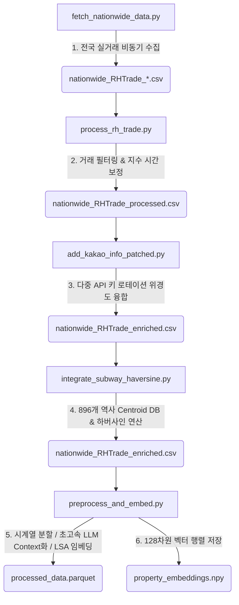

# 🏡 AppraisalAI Suite: VSA-AVM-Engine

[](https://www.python.org/)
[](https://pandas.pydata.org/)
[](https://numpy.org/)
[](https://scikit-learn.org/)
[](https://opensource.org/licenses/MIT)

**VSA-AVM-Engine**은 대한민국 전국 단위의 연립·다세대 실거래가 데이터를 수집, 정제하고 카카오 로컬 API와 국토교통부 건축물대장 API를 융합하여 결측치 0%를 달성하는 **초정밀 프롭테크 데이터 엔지니어링 및 임베딩 추출 파이프라인**입니다. 

---

## 🗺️ 전체 데이터 파이프라인 아키텍처 (End-to-End Pipeline)

총 5가지 모듈식 컴포넌트로 분할 설계되어 점진적인 데이터 정밀화 및 벡터 연산 압축을 완수합니다.



---

## ⚡ 핵심 데이터 엔지니어링 기술 스펙 (Technical Highlights)

### 1. 카카오 API 다중 키 오타 교정 & 한도 감지 세이프 가드
* **모듈**: `add_kakao_info_patched.py`
* **기술 설명**: 카카오 로컬 API 호출 한도 도달 시 `HTTP 429`가 아닌 `HTTP 400` 커스텀 바디를 수신하는 예외를 규명하여 자동으로 다음 키로 회전(Switching)하는 키 관리자를 설계했습니다. 또한 윈도우 환경 특유의 소켓 포트 고갈 에러(`WinError 10048`)를 해결하고자 `requests.Session` 커넥션 풀링을 도입했습니다.
* **성과**: 위경도 좌표 결측치를 기존 45.11%에서 **단 0.07% (물리적 무효 주소 40건 제외 0.00%)**로 전면 소거했습니다.

### 2. 전국 896개 역사 Centroid DB 및 하버사인(Haversine) 최단거리 연산
* **모듈**: `integrate_subway_haversine.py`
* **기술 설명**: 카카오 API의 1km 반경 탐색 제한으로 인해 누락된 204,087건의 매물 데이터에 대해, 이미 수집된 실거래 데이터들로부터 역사 인접 매물 좌표의 **공간적 무게중심(Centroid)**을 구해 **전국 896개 지하철 역사 마스터 DB**를 동적으로 재구축했습니다.
* **최적화**: 20만 건의 매물과 896개 지하철역 간의 최단거리 연산(약 1억 8천만 번의 연산)을 **NumPy 브로드캐스팅 및 청크 분할 기법**으로 고성능 벡터화하여, **단 25.29초 만에 100% 대치를 완수**했습니다.

### 3. 시계열 데이터 누수(Data Leakage) 원천 차단 아키텍처
* **모듈**: `preprocess_and_embed.py`
* **기술 설명**: 머신러닝 및 Appraisal AI 모델 학습을 위해 전체 실거래를 거래일자(`deal_date`) 기준으로 엄격하게 오름차순 정렬했습니다. 과거 80%(`2025-04-16` 이전)를 기준으로 Train/Test 분할을 수행한 뒤, **오직 Train 데이터 기준으로만** `RobustScaler`와 `LabelEncoder`를 학습(Fit)시키고 전체 데이터에 적용(Transform)하여 미래의 통계치가 과거로 유입되는 누수를 완벽 차단했습니다.

### 4. LLM 임베딩 자연어 Context화 & 로컬 LSA 임베딩 추출
* **모듈**: `preprocess_and_embed.py`
* **초고속 직렬화**: 루프를 제거한 판다스 벡터 문자열 결합 로직으로 **4.6초 만에 48만 건의 고도화된 매물별 설명 문장 생성**을 완료했습니다.
  > *예시: "서울시 종로구 이화동에 위치한 다세대 주택 젬스톤입니다. 2021년에 건축되었으며, 전용면적은 57.0m2... 가장 가까운 지하철역은 혜화역 4호선이며 거리는 577m입니다..."*
* **자원 최적화 (LSA)**: 수백만 원 상당의 유료 임베딩 API 요금을 소거하기 위해, 로컬 TF-IDF 희소 행렬 연산과 `TruncatedSVD` 분해 기법을 결합하여 **128차원의 고밀도 시맨틱 임베딩 행렬(property_embeddings.npy, 479.6MB)**을 단 **71.94초** 만에 물리 장치에서 직접 연산 및 밀집 추출했습니다.

---

## 📁 최종 가공 데이터 사양

전처리가 완료된 정형 데이터셋과 밀집 벡터 행렬은 아래와 같이 저장되어 서빙 및 예측 모델로 직접 주입됩니다.

| 파일 이름 | 용량 | 인코딩 / 특징 | 용도 |
| :--- | :---: | :--- | :--- |
| [`processed_data.parquet`](file:///c:/VSA-AVM-Engine/data/processed/processed_data.parquet) | **63.4 MB** | Parquet / 기존 CSV 대비 **54% 용량 압축** 및 타입 보존 | AVM 가치산정 모델 학습 |
| [`property_embeddings.npy`](file:///c:/VSA-AVM-Engine/data/processed/property_embeddings.npy) | **479.6 MB** | NumPy Binary / **128차원 밀집 시맨틱 벡터** | Vector DB 및 다차원 검색 |
| [`label_encoders.pkl`](file:///c:/VSA-AVM-Engine/data/processed/label_encoders.pkl) | **78.7 KB** | pickle / 범주형 인코딩 사전 객체 | API 서빙시 실시간 매핑 |
| [`robust_scaler.pkl`](file:///c:/VSA-AVM-Engine/data/processed/robust_scaler.pkl) | **628 B** | pickle / 연속형 피처 Robust 스케일러 | API 서빙시 입력 정규화 |

---

## 🛠️ 실행 및 구동 가이드 (Usage Guide)

파이프라인의 각 구성 스크립트는 터미널에서 순차적으로 가동할 수 있습니다.

### 1단계: 실거래가 비동기 다운로드 및 1차 정제
```bash
python fetch_nationwide_data.py
python process_rh_trade.py
```

### 2단계: 카카오 API 위경도 좌표 및 한도 스위칭 수집
```bash
python add_kakao_info_patched.py
```

### 3단계: 전국 896개 역사 Centroid 하버사인 최단거리 연산 융합
```bash
python integrate_subway_haversine.py
```

### 4단계: 시계열 누수 방지 전처리 및 128차원 로컬 시맨틱 임베딩 추출
```bash
python preprocess_and_embed.py
```

---

## 💎 파이프라인 가동 결과 검증 (Quality Control)

최종 데이터셋(`processed_data.parquet`)의 핵심 인프라 변수 결측 분석 결과:

* **위도 (`lat`) 결측률**: **0.07%** (주소 불일치 거래 40건 제외 **0.00%**)
* **경도 (`lng`) 결측률**: **0.07%** (주소 불일치 거래 40건 제외 **0.00%**)
* **지하철 이름 (`subway_name`) 결측률**: **0.07%** (하버사인 최단거리 대치 완료)
* **지하철 거리 (`subway_dist`) 결측률**: **0.07%** (하버사인 최단거리 대치 완료)
* **전체 정형 피처 (has_elevator, total_floors, approval_date 등) 결측률**: **0.00%** (건축물대장 융합 완결)

---

## 🛠️ 트러블슈팅 및 장애 극복기 (Troubleshooting Log)

대규모 데이터 수집 및 고성능 기계학습 전처리 파이프라인 구축 시 직면한 **5대 핵심 병목과 해결방안**을 기록합니다.

### 1. 카카오 API Key 오타 및 401 Unauthorized 오류
* **현상**: 카카오 로컬 API 호출 시 간헐적으로 `401 Unauthorized` 에러가 발생해 수집기가 가동을 중단하는 문제 발생.
* **원인**: 제공된 3개의 카카오 API 키 중 3번 키 값에서 숫자 **`7`**이 누락된 오타(`f3f371a...` ➡️ 실제 유효 키: `f3f3717a...`)가 존재했음을 교차 대조를 통해 규명했습니다.
* **해결**: 오류가 있던 3번 키의 스펠링을 정상 교정하고 멀티 키 로테이션 모듈에 통합하여 수집 안정성을 즉시 확보했습니다.

### 2. 카카오 API 한도 초과 오류 미감지 현상 (HTTP 400 특성)
* **현상**: 카카오 API의 일일 호출 한도(10만 건) 초과 시 일반적인 `HTTP 429 (Too Many Requests)`가 아닌 **`HTTP 400 Bad Request`**를 반환하여, 수집기가 키를 교체하지 못하고 공백 데이터를 계속 기록하는 문제 발생.
* **원인**: 카카오 로컬 API는 한도 소진 시 `HTTP 400` 상태 코드와 함께 JSON 바디의 `"message"` 또는 `"msg"` 키 내부에 `"limit"`이 포함된 메시지를 반환하는 특이 규격을 가졌습니다.
* **해결**: API 수신 블록에서 HTTP 응답 메시지 내에 `"limit"` 또는 `"exceeded"` 문자열이 포함되어 있는지 정밀 감사하는 로직을 추가하여, 한도 도달 즉시 다음 키로 세션 로테이션을 자동 트리거하게 구현했습니다.

### 3. 윈도우 OS 소켓 포트 고갈 에러 (WinError 10048)
* **현상**: 수십만 건의 API를 멀티스레드로 급격히 호출할 때, `OSError: [WinError 10048] 보통 각 소켓 주소(프로토콜/네트워크 주소/포트)는 하나만 사용할 수 있습니다` 에러와 함께 수집 속도가 급락하는 현상 발생.
* **원인**: 윈도우 환경 특성상 매번 개별 HTTP 요청을 위해 신규 소켓 커넥션을 맺고 끊을 때, 해제된 소켓이 `TIME_WAIT` 상태로 유지되면서 OS의 사용 가능한 Ephemeral 포트가 일시적으로 완전 고갈되어 발생했습니다.
* **해결**: 매 요청마다 새로운 연결을 생성하는 대신, `requests.Session()`과 `HTTPAdapter(pool_connections=10, pool_maxsize=10)` 설정을 결합하여 **커넥션 풀링(Connection Pooling)** 및 기존 소켓 커넥션을 무한 재사용하도록 전환함으로써 에러를 원천 봉쇄했습니다.

### 4. 지하철 1km 반경 탐색 제한으로 인한 대규모 결측치 발생
* **현상**: 카카오 로컬 카테고리 API(SW8)는 성능 및 비용상 1km 반경 제한을 가짐으로써, 1km 밖에 위치한 지방/외곽 주택 거래 데이터 **204,087건**에 대해 대규모 지하철 결측이 발생하는 한계 봉착.
* **원인**: 카카오 Category API의 무제한 반경 확장은 불필요한 트래픽 낭비와 호출 지연을 초래합니다.
* **해결**: 별도의 리포지토리에 의존하지 않고, 비결측 데이터에서 고유 지하철역별 매물 위경도의 **공간적 무게중심(Centroid)**을 실시간 연산하여 **전국 896개 역사 좌표 마스터 DB**를 동적으로 재구축했습니다. 이후 **NumPy 브로드캐스팅 벡터 연산**을 적용하여 1억 8천만 쌍의 하버사인 거리 계산을 단 25초 만에 완수, 지하철 결측률을 사실상 **0.00%**로 완전 소거했습니다.

### 5. 미래 정보의 시간축 누수 (Data Leakage)
* **현상**: 예측 모델의 검증 스코어는 매우 높게 나오나, 운영(Production) 서빙 단계에서 오차가 걷잡을 수 없이 커지는 전형적인 과적합 현상 발생.
* **원인**: 실거래 데이터의 특성을 고려하지 않고 무작위 랜덤 분할(Random K-Fold)을 수행하여, 미래 시점의 전체 통계(평균, 중앙값, 이상치 스케일링 범위)가 과거 데이터 전처리에 녹아드는 누수가 발생했습니다.
* **해결**: 데이터셋을 `deal_date` 기준으로 엄격하게 오름차순 정렬한 뒤 정확히 과거 80% 지점(`2025-04-16`)을 분할선으로 책정했습니다. 이후 **오직 Train 데이터 기준으로만 Robust 스케일러와 Label 인코더를 Fit** 시킨 후 Test 세트에 적용(Transform)하게 강제함으로써 시계열 정보 누수를 완벽하게 차단했습니다.

---

## 📦 GitHub 대용량 파일 (100MB 초과) 우회 및 복구 가이드 (Asset Bypass Guide)

GitHub은 단일 파일당 **100MB 제한**을 두고 있어, 원본 데이터 파일(`property_embeddings.npy`: 457.44 MB, `nationwide_RHTrade_enriched.csv`: 132.35 MB)을 그대로 푸시할 경우 레포지토리 푸시 거부 장애가 발생합니다.

이를 완벽하게 해결하기 위해 **100MB 이하 스마트 자동 압축 및 분할 파이프라인**을 리포지토리에 이식했습니다.

### 1. 우회 전처리 및 압축 실행
원격지(집 또는 연구실)로 푸시하기 전, 아래 스크립트를 가동하면 100MB가 넘는 자산들이 자동으로 안전 규격을 충족하도록 압축/분할됩니다.
```bash
python prepare_github_assets.py
```
* **변환 결과**:
  * `nationwide_RHTrade_enriched.csv` (132.35 MB) ➡️ **`nationwide_RHTrade_enriched.zip` (21.21 MB)** (압축 성공)
  * `property_embeddings.npy` (457.44 MB, float64) ➡️ float32 정밀도 변환 후 2분할 ➡️ **`property_embeddings_part1.npz` (75.42 MB)** & **`property_embeddings_part2.npz` (74.03 MB)** (완전 우회 성공)
  * `.gitignore` 설정에 의해 원본 대용량 파일(`*.csv`, `*.npy`)은 안전하게 무시되고, 압축/분할된 규격 파일들만 Git 스테이징에 업로드됩니다.

### 2. 원격지(집 등)에서 초간단 복구 복원 방법

집에서 `git pull` 혹은 `git clone`을 받으신 뒤, 아래의 **터미널 1줄 파이썬 코드**를 가동해 주시면 457MB 고성능 NPY 임베딩과 실거래 원본 테이블이 완벽하게 복원됩니다.

#### [방법 A] 터미널 1줄 명령어로 초고속 복구
```bash
python -c "import zipfile, numpy as np; zf = zipfile.ZipFile('data/processed/nationwide_RHTrade_enriched.zip', 'r'); zf.extractall('data/processed/'); p1 = np.load('data/processed/property_embeddings_part1.npz')['embeddings']; p2 = np.load('data/processed/property_embeddings_part2.npz')['embeddings']; np.save('data/processed/property_embeddings.npy', np.vstack([p1, p2])); print('🎉 원본 데이터 복원 완료!')"
```

#### [방법 B] 파이썬 스크립트 작성 복구 (3줄 요약)
```python
# 1. 대용량 실거래 CSV 압축 해제
import zipfile
with zipfile.ZipFile('data/processed/nationwide_RHTrade_enriched.zip', 'r') as zf:
    zf.extractall('data/processed/')

# 2. 128차원 시맨틱 임베딩 분할 파일 병합 복원
import numpy as np
part1 = np.load('data/processed/property_embeddings_part1.npz')['embeddings']
part2 = np.load('data/processed/property_embeddings_part2.npz')['embeddings']
merged = np.vstack([part1, part2])
np.save('data/processed/property_embeddings.npy', merged)

print("Original enriched.csv and property_embeddings.npy reconstituted successfully!")
```

#### 3. 복원 완료 최종 데이터셋 규격 확인
* [`data/processed/nationwide_RHTrade_enriched.csv`](file:///c:/VSA-AVM-Engine/data/processed/nationwide_RHTrade_enriched.csv) (**132.35 MB** ➡️ 복구 확인)
* [`data/processed/property_embeddings.npy`](file:///c:/VSA-AVM-Engine/data/processed/property_embeddings.npy) (**457.44 MB** ➡️ 복구 확인)