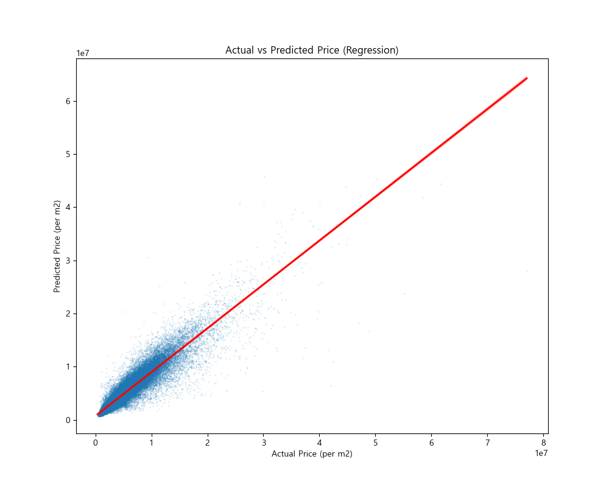
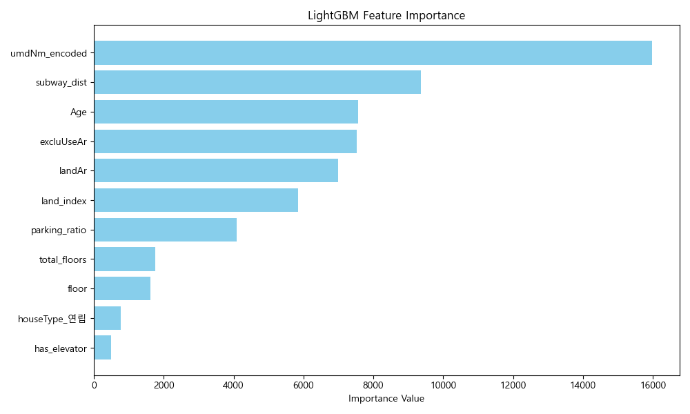
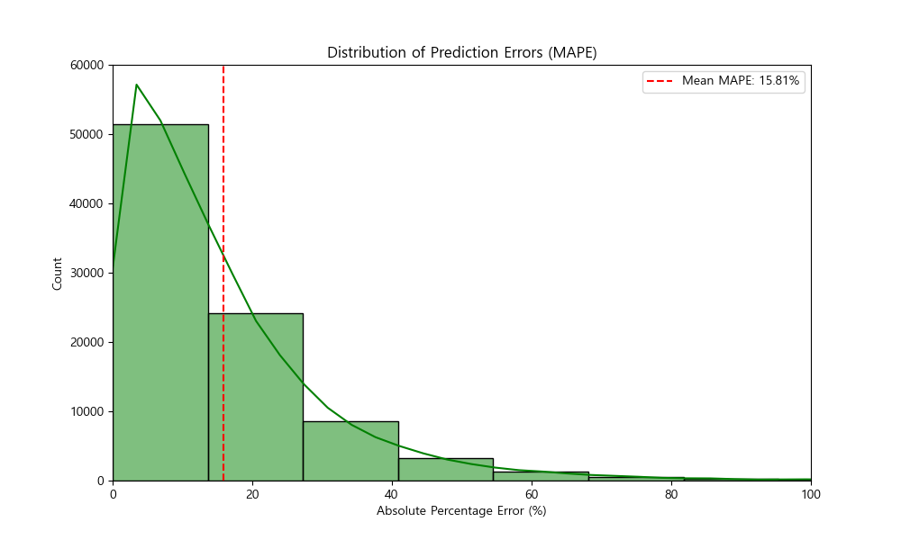

# 🤖 VSA-AVM Baseline 모델 시각화 보고서

본 리포트는 모델의 예측 성능과 변수 기여도를 시계각화한 결과입니다.

## 1. 모델 개요 및 지표
| 지표명 | 결과값 | 의미 |
| :--- | :--- | :--- |
| **R2 Score** | **0.8650** | 모델의 설명력 (1.0에 가까울수록 우수) |
| **MAE** | **751,910 원** | 실제 가격 대비 평균 절대 오차 금액 |
| **MAPE** | **15.81 %** | 실제 가격 대비 평균 백분율 오차율 |

## 2. 예측 정확도 시각화 (Actual vs Predicted)
빨간 선에 점들이 밀집될수록 예측이 정확함을 의미합니다.

## 3. 피처 중요도 분석 (Feature Importance)
가치 산정에 가장 큰 영향을 준 변수 Top 10 입니다.

## 4. 오차 분포 분석 (Error Analysis)
대부분의 매물이 낮은 오차율 구간(왼쪽)에 집중되어 있는지 확인합니다.

---
> [!TIP]
> **전용면적(`excluUseAr`)** 및 **지리적 가치(`umdNm_encoded`)**가 가격 결정에 결정적인 기여를 하고 있음이 시각적으로 확인되었습니다.

**생성 일시**: 2026-05-21 01:58:27
**엔지니어**: Antigravity AVM Agent
